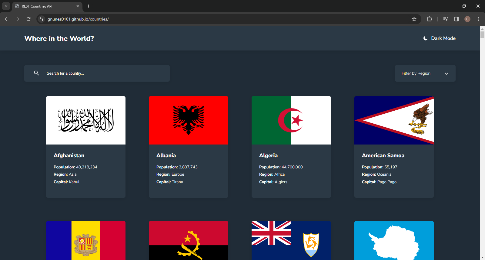
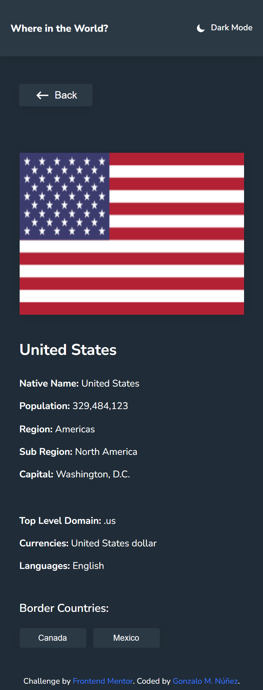

# Frontend Mentor - REST Countries API with color theme switcher solution

This is a solution to the [REST Countries API with color theme switcher challenge on Frontend Mentor](https://www.frontendmentor.io/challenges/rest-countries-api-with-color-theme-switcher-5cacc469fec04111f7b848ca). Frontend Mentor challenges help you improve your coding skills by building realistic projects. 

## Table of contents

- [Overview](#overview)
  - [The challenge](#the-challenge)
  - [Screenshot](#screenshot)
  - [Links](#links)
- [My process](#my-process)
  - [Built with](#built-with)
  - [What I learned](#what-i-learned)
  - [Useful resources](#useful-resources)
- [Author](#author)

## Overview

The challenge is integrating with the REST Countries API [REST Countries API](https://restcountries.com) to pull country data and display it like in the designs.

You can use any JavaScript framework/library on the front-end, such as React or Vue. You also have complete control over which packages you use to make HTTP requests or style your project.

### The challenge

Users should be able to:

- See all countries from the API on the homepage
- Search for a country using an `input` field
- Filter countries by region
- Click on a country to see more detailed information on a separate page
- Click through to the border countries on the detail page
- Toggle the color scheme between light and dark mode *(optional)*

### Screenshot

### Links

- Solution URL: [Click here for the solution URL](https://github.com/gnunez0101/countries)
- Live Site URL: [Click here for live site URL](https://gnunez0101.github.io/countries/)

## My process

My process began with making all layouts with HTML, then, working from top to bottom with styling for mobile layout first. I used CSS Flexbox most of the time and CSS Grid to lay out the root element only. I styled every element statically just for laying out the UI, taking the sizes from the example images provided. After that, I automated the REST API fetching process with React.JS, using states and hooks. It served me as a very good practice since I just learned to work with REST API with more complex and nested contents. Then, I added the input and <select> controls for filtering purposes. For the <select> control I used "react-select", a very nice and customizable JS library for more complex select controls. The next step was to add the detail-page information. It was a real challenge to arrange the resulting information the way it was presented on models. Some data was not easy to arrange since it was very nested in the JSON structure. After all elements were fully functional I began working on the darkmode/lightmode toggle feature. It was a very nice learning lesson with CSS and custom properties for this. Finally, I finished styling everything for the desktop screen. The main challenge of this was to scale everything to a bigger font size. In the end, it was a lot of fun, and new lessons were learned on this wonderful and more advanced challenge.

### Built with

- Semantic HTML5 markup
- CSS custom properties
- Flexbox
- CSS Grid
- Mobile-first workflow
- [React](https://reactjs.org/) - JS library
- [react-select](https://react-select.com/) - JS library
- [REST Countries API](https://restcountries.com)
- [PicPick](https://picpick.app/en/) - Very useful tools for web development tasks, like measuring of pixels with a useful ruler for images and a very nice color picker.
- VS Code editor

### What I learned

On this challenge I learned:
- A lot of react-select control. New for me. It was a real challenge to customize this with CSS.
- To get more complex REST API's and arrange very nested data into reradable information.

### Useful resources

- [react-select](https://react-select.com/) - JS library for very customizable select controls with lot of options. Much better than conventional HTML <select> control and fully customizable with CSS, Tailwinds and other methods.
- [PicPick](https://picpick.app/en/) - Very useful tools for web development tasks, like measuring of pixels with a useful ruler for images and a very nice color picker.

## Author

- LinkedIn - [Gonzalo Manuel Núñez](https://www.linkedin.com/in/gnunez0101)
- Frontend Mentor - [@gnunez0101](https://www.frontendmentor.io/profile/gnunez0101)